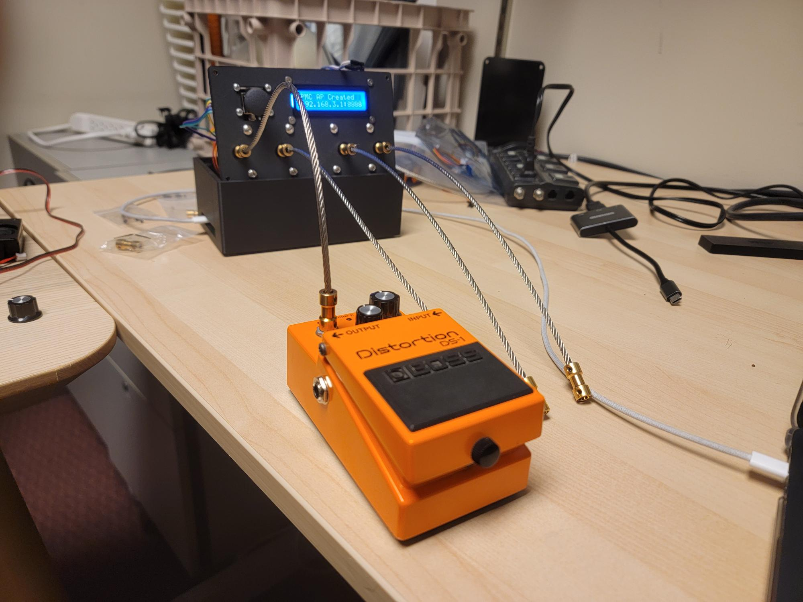
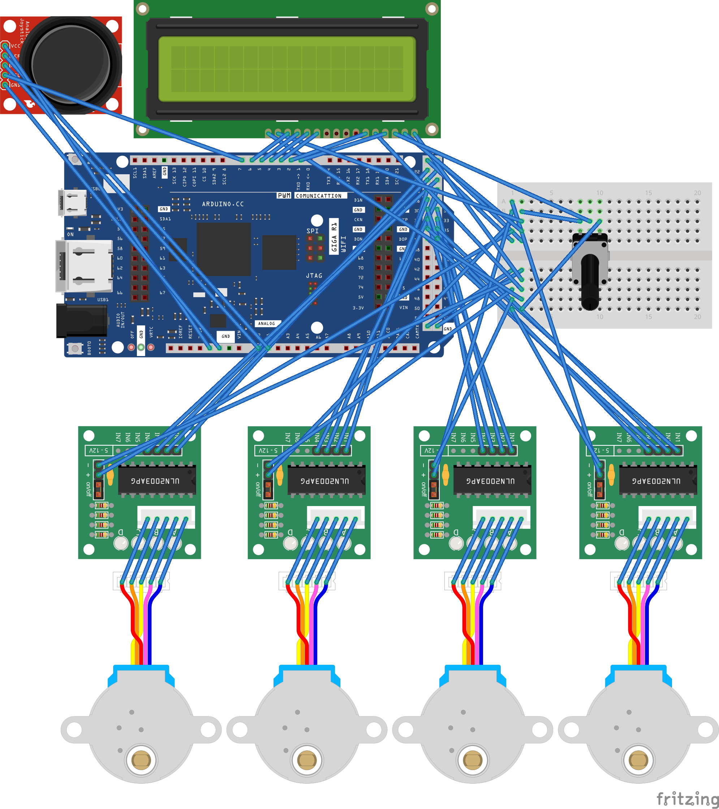

# PedalMotorController: An Arduino platform for programmatically turning pedal knobs

## Description

The Pedal Motor Controller (abbreviated PMC) is a device that mechanically turns guitar pedal knobs using gyroscopic data for expressive guitar performance. Users can connect their phone over UDP to an Arduino hub that translates their phone's gyroscopic movements into knob turns. The knob turns can then influence music performed with the pedals.

If the user attaches their phone to the guitar headstock, then movements of the guitar will have a direct correlation to sonic output. This is especially relevant for gestural research, as it provides a platform for investigating the relationship between performance gestures and musical style.

## Usage

1. Remove the knob from the desired pedal parameter and attach a coupler to the exposed potentiometer
2. Download the [Serial Sensor](https://play.google.com/store/apps/details?id=com.karl.serialsensor) app on your phone
3. Turn on the PMC and connect to its WiFi access point on your phone (SSID and password are both "PedalMotorController")
4. In Serial Sensor, under the Sensors tab, select only **Gyroscope**
5. Under the Connection tab, select **Network** and input the IP address and port shown on the PMC's display
6. Press the play button in SerialSensor when you are ready to send data (you may need to do this twice for it to register)

## Installation

(This guide is only for those who want to make their own PMC.)

1. Clone this repository to your machine.
2. In `src`, zip each folder into an individual file, EXCLUDING `src/Main`.
3. Install the [Arduino IDE](https://www.arduino.cc/en/software/) and launch. Under the Sketch tab, select `Include Library > Add .ZIP Library...`
4. Select and install each of the zipped folders you created in step 2.
5. Under the `Libraries` tab on the left (bookshelf icon), search and install `AccelStepper` and `arduino-timer`. These are external libraries that the PMC uses.
6. Once all zips are installed, make sure the program compiles by clicking the checkmark on the top left (labeled `Verify`).
7. Finally, connect an Arduino GIGA to your computer, select it in the top left, and select `Upload`.

## Hardware

### Fritzing Diagram

### Parts List

* Arduino GIGA R1 WiFi
* 4x 28BYJ-48 stepper motors
* 4x ULN2003 stepper motor drivers
* LCD1602 2x16 LCD display
* Joystick module
* Mini breadboard
* 3-pin potentiometer
* Jumper wires

## Credits

Created by Ian Doherty, fall 2025 through winter 2026, at McGill University's Input Devices and Music Interaction Laboratory (IDMIL).

This project was inspired by similar knob-turning devices, including the [Toe-N Control Pedal](https://dukedesigns3d.com/products/toe-n-control-v1-universal-expression-59517), the [Gecko Tool](https://geckotool.com/), and the [Knoblin](https://github.com/narad/knoblin). **The ideas underpinning this project are not novel**; my sole intent is to explore controlling effect automation using gestures.

The hardware diagram was generated using [Fritzing](https://fritzing.org), [fritzing-parts](https://github.com/mgesteiro/fritzing-parts/tree/main) (28BYJ-48, ULN2003), and [this Arduino GIGA R1 WiFi Fritzing part](https://forum.fritzing.org/t/arduino-giga-r1-wifi/20039).

Special thanks to Dr. Marcelo Wanderley for his supervision and Darryl Cameron for his assistance in assembly.